# [v-layouts](https://terryz.github.io/docs-vue3/layout/)
<!-- &middot; -->
[](https://circleci.com/gh/TerryZ/v-layouts/tree/main)
[](https://codecov.io/gh/TerryZ/v-layouts)
[](https://www.npmjs.com/package/v-layouts)
[](https://mit-license.org/)
[](https://www.npmjs.com/package/v-layouts)

Web page layout collection for **Vue3**

## Examples and Documentation

Documentation and examples please visit below sites

- [Github pages](https://terryz.github.io/docs-vue3/layout/)

### Layout and modules diagram

admin classic layout



content press layout


panel group modules


## Installation

```sh
# npm
npm i v-layouts
# yarn
yarn add v-layouts
# pnpm
pnpm add v-layouts
```

## Usage

### LayoutAdminClassic

```vue
<template>
  <LayoutAdminClassic>
    <template #header>
      Header
    </template>
    <template #aside>
      Aside
    </template>
    <template #breadcrumb>
      Breadcrumb
    </template>
    <template #footer>
      Footer
    </template>

    <div>Main content</div>
  </LayoutAdminClassic>
</template>

<script setup>
import { LayoutAdminClassic } from 'v-layouts'
</script>
```

### Panel group

```vue
<template>
  <PanelGroup>
    <PanelItem name="panel1">
      <template #header>
      panel 1 header
      </template>
      panel 1 content
    </PanelItem>
    <PanelItem name="panel2">
      <template #header>
      panel 2 header
      </template>
      panel 2 content
    </PanelItem>
  </PanelGroup>
</template>

<script setup>
import { PanelGroup, PanelItem } from 'v-layouts'
</script>
```
